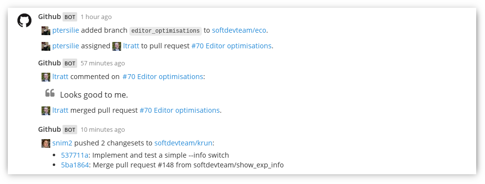

# Github integration for Mattermost

Inspired by [mattermost-integration-gitlab](https://github.com/NotSqrt/mattermost-integration-gitlab) this program creates a server using [flask](https://github.com/mitsuhiko/flask) that listens for incoming GitHub event webhooks. These are then processed, formatted, and eventually forwarded to Mattermost where they are displayed inside a specified channel.


## Requirements
### System requirements
- Python3 or Python2

### Application requirements

- Flask (install with `pip install flask`)
- requests (install with `pip install requests`)
- (optional) PIL (install with `pip install pillow`) - needed to hide big Github avatars

All requirements can also be installed using the command

`pip install -r requirements.txt`

## Installation and usage

### Method 1: running the application from the project directory

1. Clone the repository
2. Within the `mattermostgithub` directory, copy `config.template` to `config.py` and edit it with your details. For example:

```python
USERNAME = "Github"
ICON_URL = "yourdomain.org/github.png"
MATTERMOST_WEBHOOK_URLS = {
    'default' : ("yourdomain.org/hooks/hookid", "off-topic"),
    'teamname/repositoryname' : ("yourdomain.org/hooks/hookid2", "repository-channel-id"),
    'teamname' : ("yourdomain.org/hooks/hookid3", "town-square"),
    'teamname/unimportantrepo' : None,
}
GITHUB_IGNORE_ACTIONS = {
    "issues": ["labeled", "assigned"],
}
SECRET = 'secretkey'
SHOW_AVATARS = True
SERVER = {
    'hook': "/"
,   'address': "0.0.0.0"
,   'port': 5000
}
```

Start the server with `python server.py`.

### Method 2: installing the application with pip

1. Create a `virtualenv`:

```
virtualenv -p python3 env
. env/bin/activate
```

2. Install with `pip`

```
pip install git+https://github.com/softdevteam/mattermost-github-integration
```

3. Download `config.template` and save it as `config.py` on your machine, changing your details as described above.

The project can then be run as a flask application:

```
export FLASK_APP=mattermostgithub
export MGI_CONFIG_FILE=path/to/config.py
flask run
```

### Webhooks
GitHub messages can be delegated to different Mattermost hooks. The order is as
follows:
- First try to find a hook for the repositories full name.
- If that fails, try to find a hook for the organisation name.
- Otherwise use the default hook.

Repositories can be blacklisted by setting them to `None` instead of
`(url, channel)`.

### Ignore actions
Specific Github events can be ignored by adding `GITHUB_IGNORE_ACTIONS` to `config.py`. In the example above `labeled` and `assigned` events for
issues are ignored, while `opened`, `closed`, etc. events will continue to show
up on Mattermost.

### Server settings
The server is listening by default on address `0.0.0.0`, port `5000`, and
using `/` as base route.
Make sure to point your Github webhooks to `http://yourdomain.org:5000/`.

If you have a proxy/load-balancer in front of your machine, and do not want to
expose port 5000 to the outside, change the `SERVER['hook']` value and redirect it
to this service.
For example, if `SERVER['hook']` is `/hooks/github`, your Github webhooks
would be `http://yourdomain.org/hooks/github`.

### Secret
If you don't want to use a secret set the field to `None`.

## Deploying with Docker

To deploy with Docker, make sure you have Docker installed and run:

```
docker build --rm=true -t mm-github .
docker run --rm -v "$(pwd)":/home/app -w /home/app -p 5000:5000 -ti mm-github
```

If you want to run in background mode, change the option `--rm` for `-d`.

## Supported Events

Not all Github events are forwarded to Mattermost. Currently supported events are:

* Ping events (send when first adding the Github webhook)
* Commit pushes and comments
* Issues (open, close, comment)
* Pull Requests (create, merge, remove, comment)
* Create/Delete repositories
* Create/Delete branches and tags

All other events will report back to GitHub with `400 Not Implemented`.

## Known issues

- Channel names need to use the spelling that is used in their URL (the channel ID), e.g. instead
of `Town Square` it needs to be `town-square`.

- If you set a custom username (as shown in the default config), make sure you also set **Enable webhooks and slash commands to override usernames** under **Custom Integrations** in the System Console to **True**. Otherwise the bots username will be that of the person that setup the Mattermost integretation.
